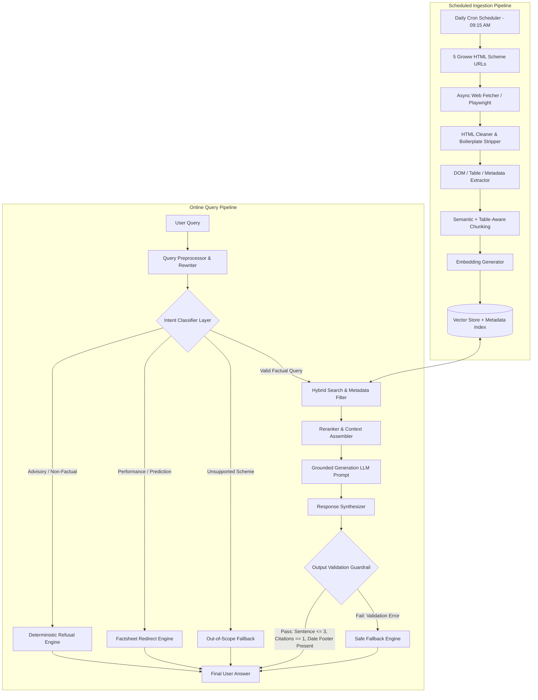
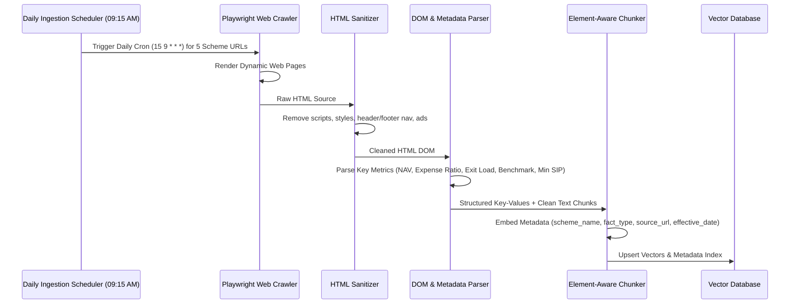
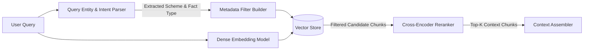
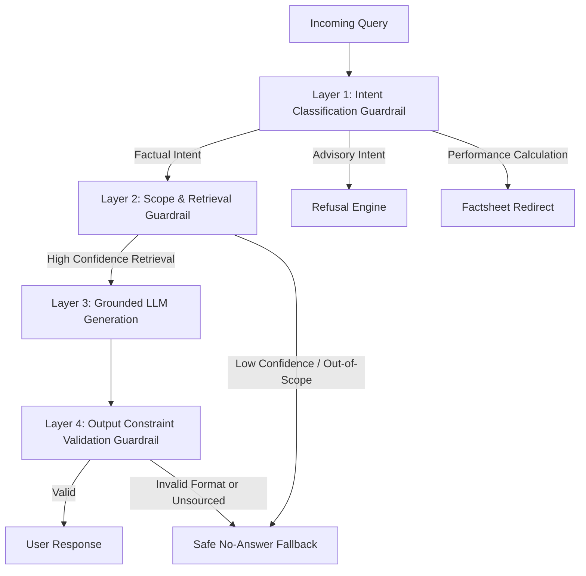

# System Architecture & Technical Specification
## Groww Mutual Fund Facts-Only FAQ Assistant

**Version:** 1.0.0  
**Date:** August 2026  
**Status:** Architecture Design Document  
**Scope:** HTML-only RAG Pipeline for 5 Groww Mutual Fund Scheme Web Pages (Strictly No PDFs)

---

## 1. Executive Summary & Architectural Scope

The **Groww Mutual Fund Facts-Only FAQ Assistant** is a specialized Retrieval-Augmented Generation (RAG) system engineered to answer objective, factual financial queries regarding selected mutual fund schemes on Groww. 

> [!IMPORTANT]
> **Core System Constraints & Ingestion Boundaries:**
> 1. **Data Source Scope:** Ingestion is strictly restricted to **5 explicit Groww mutual fund scheme web pages** (HTML scraping only).
> 2. **No PDF Files:** The system explicitly excludes PDF files (factsheets, KIMs, SIDs, regulatory documents).
> 3. **Daily Automated Ingestion Scheduler:** System runs an automated daily ingestion job at **9:15 AM daily** (`15 9 * * *`) to refresh HTML metrics, NAVs, and dates.
> 4. **Facts-Only Enforcement:** The assistant strictly answers factual queries (expense ratio, exit load, minimum SIP, benchmark, riskometer) and deterministically refuses advisory, recommendation, or opinion queries.
> 5. **Strict Output Formatting:** Every factual response must be **≤ 3 sentences**, contain **exactly 1 citation link** pointing to one of the 5 ingested URLs, and include a **"Last updated from sources: <date>"** footer.

### 1.1 Ingested URL Scope

| Scheme Name | Target URL | Content Type |
|---|---|---|
| HDFC Mid-Cap Opportunities Fund Direct Growth | `https://groww.in/mutual-funds/hdfc-mid-cap-fund-direct-growth` | HTML |
| HDFC Silver ETF Fund of Fund Direct Growth | `https://groww.in/mutual-funds/hdfc-silver-etf-fof-direct-growth` | HTML |
| HDFC Defence Fund Direct Growth | `https://groww.in/mutual-funds/hdfc-defence-fund-direct-growth` | HTML |
| HDFC Flexi Cap Fund Direct Growth (HDFC Equity Fund) | `https://groww.in/mutual-funds/hdfc-equity-fund-direct-growth` | HTML |
| HDFC Small Cap Fund Direct Growth | `https://groww.in/mutual-funds/hdfc-small-cap-fund-direct-growth` | HTML |

---

## 2. High-Level System Architecture

The architecture follows a dual-pipeline model:
1. **Scheduled Ingestion Pipeline:** Runs automatically **daily at 9:15 AM** (and via manual admin trigger). Crawls the 5 designated Groww URLs, extracts structured/unstructured HTML elements, performs section-aware chunking, generates dense embeddings, and updates the vector database.
2. **Online Query & Response Pipeline:** Classifies user intent, retrieves relevant context from the vector database using hybrid search and metadata filtering, synthesizes a grounded answer via an LLM, and enforces strict post-processing guardrails.



---

## 3. Detailed Component Architecture

### 3.1 Data Ingestion & HTML Processing Pipeline

Because PDFs are excluded, the ingestion pipeline relies entirely on high-fidelity HTML extraction from Groww's scheme web pages.



#### Ingestion Components:

1. **Daily Automated Scheduler (`ingestion/scheduler.py`):**
   - Implements an automated scheduler (`APScheduler` AsyncIOScheduler / Cron) configured to run **daily at 9:15 AM IST** (`15 9 * * *`).
   - Executes the automated pipeline: trigger fetch → parse metrics → chunk → update vector DB → log execution timestamps.
   - Provides a manual admin API trigger (`POST /api/v1/ingest`) for on-demand syncs.

2. **Web Crawler (`ingestion/crawler.py`):**
   - Uses headless browser automation (Playwright/Selenium) or async HTTP fetching (`httpx`) to handle client-rendered HTML content on Groww.
   - Rate-limited and user-agent configured to maintain respectful scraping patterns.

3. **HTML Sanitizer & Extractor (`ingestion/extractor.py`):**
   - Strips non-content elements (`<nav>`, `<header>`, `<footer>`, `<script>`, `<style>`, `<button>`).
   - Extracts structured scheme overview cards, charge details, holdings summaries, and disclosure sections.
   - Extracts scheme metadata:
     - `scheme_name` (e.g., "HDFC Mid-Cap Opportunities Fund Direct Growth")
     - `source_url` (one of the 5 canonical URLs)
     - `last_crawled_timestamp`
     - `last_updated_date` (extracted from the page disclosure footer if present)

---

### 3.2 Chunking Strategy & Metadata Schema

Standard sliding-window chunking breaks tabular and key-value financial data. The architecture utilizes **Semantic + Element-Aware Chunking**.

#### Chunk Types:
1. **Key-Value Fact Chunks:** Atomic chunks for single attributes (e.g., Expense Ratio, Exit Load, Minimum SIP, Benchmark, Riskometer).
2. **Tabular Chunks:** Preserved markdown tables (e.g., Returns table, Peer comparison table, Historical NAV summary).
3. **Paragraph Chunks:** Continuous text blocks (e.g., Investment objective, Fund manager bio, Scheme details).

#### Metadata Schema:

```json
{
  "chunk_id": "hdfc_midcap_exit_load_01",
  "scheme_name": "HDFC Mid-Cap Opportunities Fund Direct Growth",
  "scheme_slug": "hdfc-mid-cap-fund-direct-growth",
  "source_url": "https://groww.in/mutual-funds/hdfc-mid-cap-fund-direct-growth",
  "fact_type": "exit_load",
  "section_title": "Expense Ratio, Exit Load & Taxes",
  "content_format": "key_value",
  "effective_date": "2026-08-01",
  "last_crawled": "2026-08-12T10:00:00Z",
  "raw_text": "Exit Load: 1% if redeemed within 1 year from the date of allotment; Nil if redeemed after 1 year."
}
```

---

### 3.3 Vector Database & Hybrid Retrieval Engine

To achieve high accuracy and eliminate cross-scheme retrieval confusion, the system employs **Hybrid Search with Strict Metadata Filtering**.



#### Retrieval Rules:
1. **Metadata Pre-Filtering:** If the query mentions a specific scheme (e.g., "HDFC Defence Fund"), the retriever filters vector search strictly to chunks matching `scheme_slug == "hdfc-defence-fund-direct-growth"`.
2. **Dense Vector Search & Vector Store:** Performs cosine similarity search over dense 1024-dimensional vector embeddings generated using **`BAAI/bge-large-en-v1.5`**, indexed in a **Chroma DB Local Store** (`chromadb.PersistentClient(path="data/vector_db")`).
3. **Confidence Thresholding:** Retained chunks must satisfy a minimum similarity score (e.g., cosine similarity ≥ 0.75). If no chunks pass the threshold, the retrieval engine triggers the No-Answer Fallback.

---

## 4. Multi-Layer Guardrail Architecture

Financial accuracy demands multiple independent guardrail layers to guarantee zero financial advice, zero hallucinations, and full constraint compliance.



### 4.1 Layer 1: Intent Classification Guardrail

Every query is pre-classified before any RAG context is sent to the generation model.

| Intent Category | Description | Example Queries | Action |
|---|---|---|---|
| **Factual Query** | Seeking objective facts present on scheme pages | "What is the expense ratio?", "What is the benchmark?" | Execute Retrieval & RAG |
| **Advisory Query** | Requesting advice, opinion, or recommendation | "Should I buy HDFC Small Cap?", "Which fund is best for 5 years?" | Trigger Deterministic Refusal |
| **Performance Query** | Asking for return calculations or future growth | "How much will 10k grow in 3 years?", "Predict returns" | Trigger Factsheet/Scheme Redirect |
| **Out-of-Scope Scheme** | Asking about non-indexed schemes (e.g. SBI, ICICI) | "What is the NAV of SBI Bluechip?" | Trigger Scope Limitation Fallback |

#### Deterministic Refusal Template:

> "I can provide factual information about supported mutual fund schemes, but I cannot offer investment advice, opinions, or fund recommendations. You can review the official scheme page for objective details.
> 
> **Source:** [https://groww.in/mutual-funds/hdfc-mid-cap-fund-direct-growth](https://groww.in/mutual-funds/hdfc-mid-cap-fund-direct-growth)  
> **Last updated from sources:** 12 August 2026"

---

### 4.2 Layer 2: Scope & Grounding Guardrail

- Checks whether the query maps to one of the 5 supported schemes.
- Ensures the model never attempts to use internal pre-trained knowledge to answer financial questions when context is missing or low-confidence.

---

### 4.3 Layer 3: Grounded Generation Prompting

The LLM is prompted under strict constraints.

#### System Prompt Template (`backend/prompts/system_prompt.txt`):

```text
You are the Groww Mutual Fund Facts-Only FAQ Assistant.
Your sole job is to provide accurate, concise factual answers about mutual fund schemes based EXCLUSIVELY on the provided context.

STRICT CONSTRAINTS:
1. Answer ONLY using the facts present in the CONTEXT below. Do NOT use outside knowledge or assumptions.
2. If the answer cannot be verified from the CONTEXT, state exactly: "I couldn't verify this information from the available official sources."
3. Your response MUST NOT exceed 3 sentences in total.
4. You MUST include EXACTLY ONE Markdown citation link pointing to the source URL provided in the metadata.
5. You MUST include a footer on a new line: "Last updated from sources: <date>".
6. Do NOT provide investment advice, recommendations, performance predictions, or comparisons.

CONTEXT:
{retrieved_chunks}

USER QUERY:
{user_query}
```

---

### 4.4 Layer 4: Output Validation Guardrail

Before transmitting any generated response to the user, an automated Output Validator evaluates the response against 5 programmatic checks:

```python
def validate_response(response_text: str, allowed_urls: set) -> bool:
    # Rule 1: Maximum 3 sentences
    sentences = split_into_sentences(response_text)
    if len(sentences) > 3:
        return False
    
    # Rule 2: Exactly one citation URL
    urls_found = extract_markdown_links(response_text)
    if len(urls_found) != 1:
        return False
    
    # Rule 3: Citation URL must be in the 5 allowed Groww URLs
    if urls_found[0] not in allowed_urls:
        return False
    
    # Rule 4: Must contain "Last updated from sources:" footer
    if "Last updated from sources:" not in response_text:
        return False
    
    # Rule 5: No forbidden advisory keywords
    advisory_keywords = ["should buy", "recommend", "best fund", "guaranteed return"]
    if any(kw in response_text.lower() for kw in advisory_keywords):
        return False
        
    return True
```

If validation fails, the API automatically replaces the response with the safe fallback message:
> *"I couldn't verify this information from the available official sources."*

---

## 5. API Specification & Endpoints

### 5.1 POST `/api/v1/chat`

Handles incoming user questions, executes intent classification, retrieval, generation, and validation.

#### Request Payload:
```json
{
  "query": "What is the exit load of HDFC Defence Fund Direct Growth?",
  "session_id": "usr_session_982341"
}
```

#### Response Payload (Factual Answer):
```json
{
  "status": "success",
  "query_intent": "factual",
  "answer": "The exit load for HDFC Defence Fund Direct Growth is 1% if units are redeemed within 1 year from allotment. No exit load is applicable if redeemed after 1 year.",
  "source_url": "https://groww.in/mutual-funds/hdfc-defence-fund-direct-growth",
  "last_updated": "12 August 2026",
  "sentence_count": 2,
  "confidence_score": 0.94
}
```

#### Response Payload (Advisory Refusal):
```json
{
  "status": "refused",
  "query_intent": "advisory",
  "answer": "I can provide factual information about supported mutual fund schemes, but I cannot offer investment advice or recommendations. You can review the official scheme page for objective details.",
  "source_url": "https://groww.in/mutual-funds/hdfc-defence-fund-direct-growth",
  "last_updated": "12 August 2026",
  "sentence_count": 2,
  "confidence_score": 1.0
}
```

---

## 6. Verification, Evaluation & Quality Metrics

The implementation quality will be continuously evaluated against an automated test suite.

### 6.1 Performance Benchmarks

| Metric Name | Target SLA / Goal | Measurement Method |
|---|---|---|
| **Factual Accuracy** | **≥ 95%** | Correctness evaluation against ground-truth dataset |
| **Citation Validity** | **≥ 98%** | Verification that citation URL is valid and matches chunk |
| **Refusal Accuracy** | **≥ 98%** | Correct rejection of advisory/recommendation queries |
| **Constraint Compliance** | **≥ 99%** | Sentence count ≤ 3, citation count == 1, date footer present |
| **Groundedness (Faithfulness)** | **≥ 95%** | Ragas / TruLens context hallucination check |
| **Response Latency (P95)** | **< 3.0s** | End-to-end API response time monitoring |

### 6.2 Evaluation Dataset Matrix (`evaluation/test_dataset.json`)

The system is tested against 75 curated query pairs:
- **50 Factual Queries** (Expense ratio, exit load, min SIP, benchmark, riskometer across all 5 schemes).
- **15 Advisory & Recommendation Queries** ("Which fund to buy?", "Is HDFC Small Cap good?", "Should I switch?").
- **10 Edge/Out-of-Scope Queries** (Non-indexed schemes, return predictions, prompt injections).

---

## 7. Compliance & Data Privacy Constraints

1. **Zero PII Storage:** The application does not solicit, collect, or log personal identifiable information (PII), PAN, Aadhaar, bank details, or portfolio holdings.
2. **Stateless Query Pipeline:** Chat interactions are evaluated statelessly; no financial user profiling is built or persisted.
3. **Transparent Source Freshness:** Every response clearly displays when the source content was last updated from Groww scheme pages.
